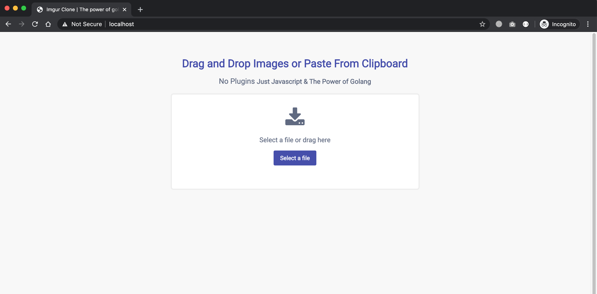

</a>

<b>Imgur clone built in golang and pure javascript.</b>

</a>

## Features

- Drag and Drop File Upload
- Upload Image from Clipboard
- Limit File Size
- CSRF Protection

## Credits

The people who made this project a reality:

- [Amanullah Tanweer](https://github.com/amanullahtanweer)
- [Ali Taha Skahir](https://github.com/alitahashakir)

## License

This project is released under the [MIT License](LICENSE).
